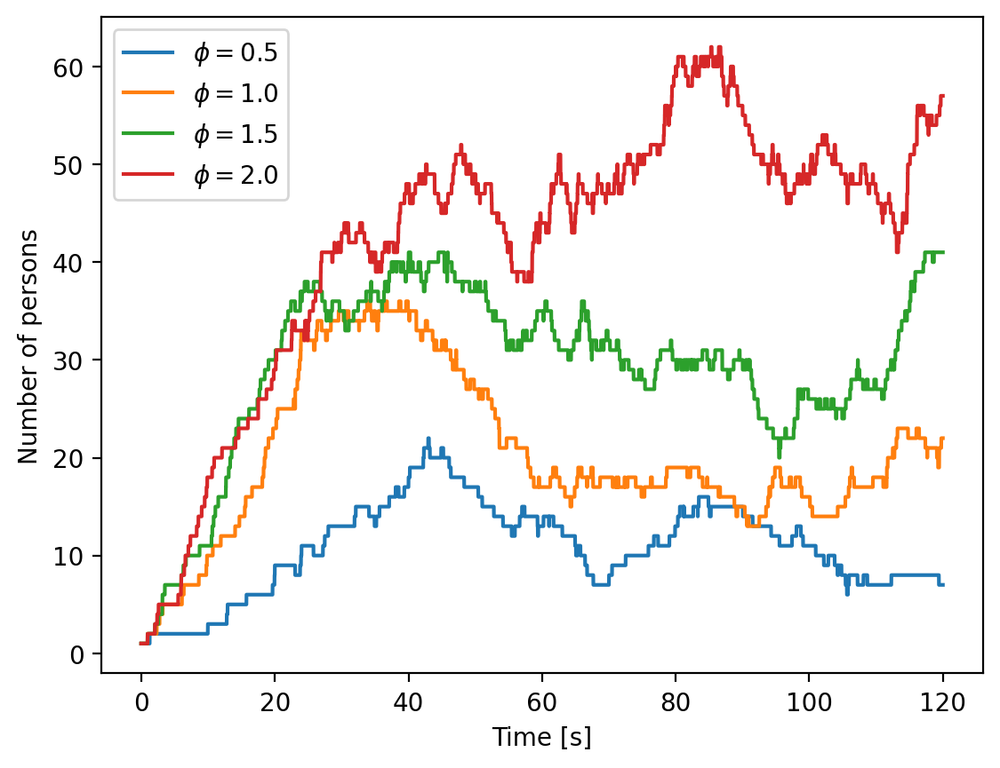

# PedestFlow

## About the model

This code tries to simulate a pedestrian flow in two crossing streets, as explained [here](https://gist.github.com/meiemari/b20406e05eb2aed6367361f85d552802​​​).

## Equations of motion

The rules of the pedestrian behaviour are encoded into the following equations of motion:

$$
\frac{d\boldsymbol{r}}{dt} = \boldsymbol{v}_i(t)
$$

$$
\frac{d\boldsymbol{v}_i}{dt} = f_{tot}(t)/m
$$

with $m$ being the mass and $f_{tot}$, the total force. The total force it self is calculated by

$$
f_{tot} = f_{inter} + f_{drive}
$$

Where $f_{inter}$ is the force from interactions with other pedestrians and walls ans the friving force is the force toward the destination of pedestrians. 


## Running locally

### Installing packages

This code base is using the Julia Language and [DrWatson](https://juliadynamics.github.io/DrWatson.jl/stable/)
to make a reproducible scientific project named
> PedestFlow

It is authored by Ehsan Irani.

To (locally) reproduce this project, do the following:

0. Download this code base. Notice that raw data are typically not included in the
   git-history and may need to be downloaded independently.
1. Open a Julia console and do:
   ```
   julia> using Pkg
   julia> Pkg.add("DrWatson") # install globally, for using `quickactivate`
   julia> Pkg.activate("path/to/this/project")
   julia> Pkg.instantiate()
   ```

This will install all necessary packages for you to be able to run the scripts and
everything should work out of the box, including correctly finding local paths.

### Running the code
first include the main code by
   ```
   julia> include(srcdir("ehsan.jl"))
   ```
   
Then define the pedestrian-flow model by
   ```
   julia> model = initialize_model(n_persons = 1, ϕ=1.0, dt=0.005, σ=0.5, γ=0.0, m=1, θ = 3π/4, Rv=4, β=0.0, seed=11)
   ```
here `ϕ` is the rate of adding new people, $\theta$ is the view angle and `Rv` is the visual board of pedestrians.

After defining the model, one can run the simulation by

   ```
   julia> adf, _ = run!(model, agent_step!, model_step!, Int(120 ÷ model.dt);
            agents_first = false,
            adata = [:pos, :vel])
   ```
with `adf` is a dataframe containing the position and velocity informations of agents. One can save it by

   ```
   julia> using CSV
   julia> CSV.write(datadir(savename("agents", "csv")), adf)
   ```


### Sample plots

Here the population size of the simulations at different flow rates is plotted.


   
